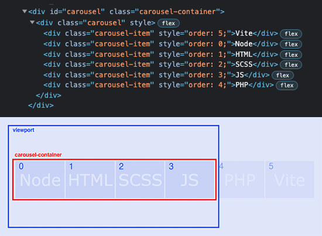
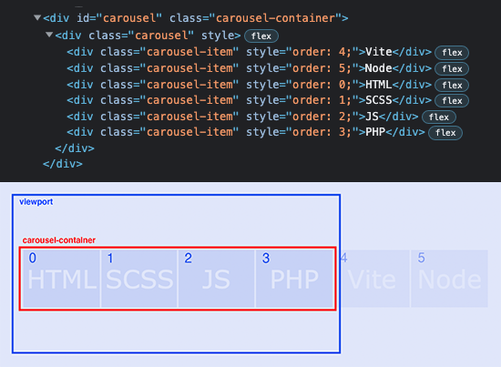

# Simple Vanilla Javascript/SCSS Carousel
This project presents an example of a simple vanilla javascript carousel/slider built with the power of CSS3 Flexbox layout. The design is responsive and styled with SCSS.


## Using Flexbox for Slider design
CSS3 Flexbox is a powerful layout technique well supported by all modern browsers. It has all needed to build a responsive slider reqiring a minimum of javascript code.

[Demo](https://phpcoder.github.io/simple-carousel) shows a few slider examples to illustrate how flexbox layout is used. This design is build around the flexbox property ```order: N```. Reordering of flexbox carousel items by changing this property allows for smooth looping effect without the need to clone items in DOM.

The following images are snapshots of DOM elements in a browser development window. They show an example of a text based carousel. The first snapshot shows an initial ordering of slider items with a schematic view of carousel elements in browser viewport and carousel container. The order value is seen at the corresponding slider item.


The ```carousel``` element includes all carousel items lined up using ```flex-direction:row``` with ordering ready for a move left by one step. After move animation is finished, items are reordered simultaneously with a reset of horizontal position. This phase is shown at the next snapshot.



Finally, one more move-reorder-reset step is given at the next snapshot. As we can see the smooth scroll of slider items can be achieved with Flexbox without the need to clone carousel elements.



More detail with live carousel in action can be seen on [Demo](https://phpcoder.github.io/simple-carousel).

## Responsive features
Responsive features are made with CSS media queries. To simplify the design of responsive layout and breakpoint selection a SCSS mixin is used. Breakpoints (in px) and corresponding number of visible items (n) are configured in ```src/scss/main.scss``` as follows:
```

$carousel-breakpoints: (
//	px    n
	0 :   1,
	480:  2,
	800:  3,
	1200: 4
);

@include carousel-bp('#carousel', $carousel-breakpoints, 6);
```


## Links
* [Flexbox](https://css-tricks.com/snippets/css/a-guide-to-flexbox/) - A Complete Guide to Flexbox
* [Vite](https://vitejs.dev/) - Next Generation Frontend Tooling


## License
Released under the [MIT License](http://www.opensource.org/licenses/mit-license.php) - see the [LICENSE](LICENSE) file for details.